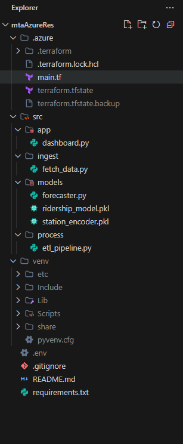

# 🚇 MTA Azure Transit Brain


**An Enterprise-Grade Transit Analytics Platform built on Microsoft Azure.**
This project demonstrates a full pseudo-distributed architecture: **Infrastructure as Code (IaC)**, **Data Lake Storage (Gen2)**, **Machine Learning**, and **Interactive Dashboards**.

---

## 📸 Dashboard Preview


---

## 🏗️ Architecture & Project Structure
The project follows a **Medallion Architecture** (Bronze $\rightarrow$ Silver $\rightarrow$ Gold) within Azure Data Lake Storage.



*   **Infrastructure**: Terraform (`.azure/main.tf`) provisions the Storage Accounts and Resource Groups.
*   **Ingestion**: `src/ingest/` pulls raw data from the MTA API into the **Bronze** container.
*   **Processing**: `src/process/` cleans and aggregates data (Spark-like ETL) into **Silver** and **Gold** containers.
*   **Modeling**: `src/models/` trains a Random Forest Regressor on "Gold" data to predict ridership.
*   **App**: `src/app/` serves a Streamlit dashboard for real-time inference.

---

## 🛠️ Prerequisites
1.  **Azure Subscription** (Active Student/Free Tier is fine)
2.  **Azure CLI** (`az login` must be run first)
3.  **Terraform** installed
4.  **Python 3.10+**

---

## ⚡ Deployment Instructions

### 1. Provision Cloud Infrastructure
Deploy the Azure resources using Terraform.
```bash
cd .azure
terraform init
terraform apply -auto-approve
```

### 2. Configure Environment
Create a `.env` file in the root directory:
```properties
AZURE_STORAGE_ACCOUNT_NAME=mtadls<your_unique_id>
```

### 3. Run the Data Pipeline
Execute the full flow from local machine $\rightarrow$ Cloud.
```bash
# 1. Ingest: Download 500MB+ data -> Azure Bronze
python src/ingest/fetch_data.py

# 2. Process: Bronze -> Silver (Clean) -> Gold (Aggregated)
python src/process/etl_pipeline.py

# 3. Train: Read Gold -> Train Random Forest -> Save .pkl
python src/models/forecaster.py
```

### 4. Launch the AI Dashboard
Start the interactive application.
```bash
streamlit run src/app/dashboard.py
```

---

## 🔒 Security
*   **RBAC**: Uses `Azure DefaultCredential` (identity-based access) instead of hardcoded keys.
*   **Environment Variables**: All storage names are decoupled from the code.
*   **Local Execution**: Simulates a Databricks environment by running logic locally but processing data against the Cloud.

---
*Created by Mohammed Al-Muqsit*
